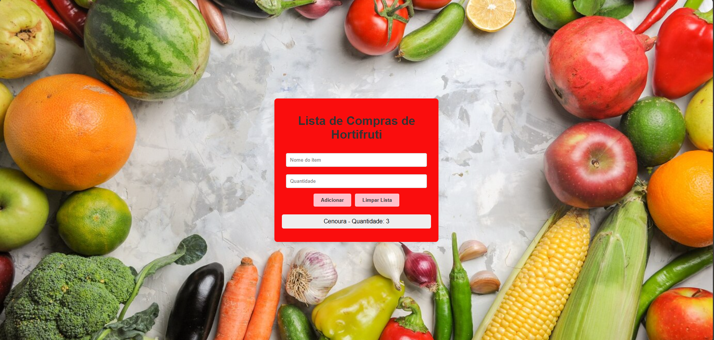
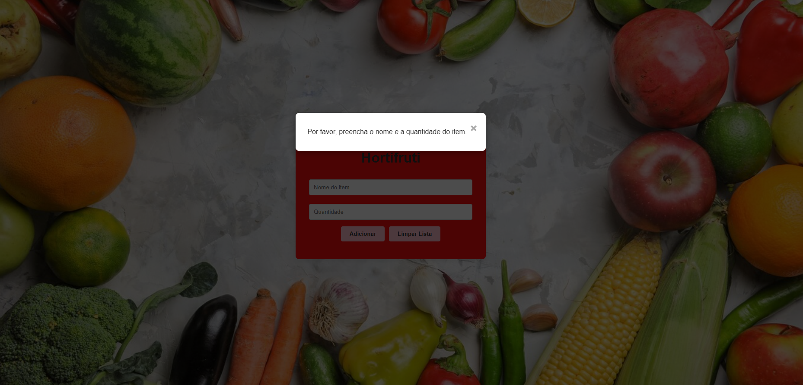

# Shopping

Este é um projeto simples de uma aplicação de lista de compras desenvolvida em React. O aplicativo permite que os usuários adicionem itens e quantidades à lista e exibe um pop-up caso tentem adicionar um item sem preencher os campos obrigatórios.

## Funcionalidades

- Adicionar itens à lista de compras com nome e quantidade.
- Exibir um pop-up (modal) quando os campos não estão preenchidos corretamente.
- Limitar a quantidade de caracteres para o nome do item e a quantidade.
- Limpar a lista de compras.
